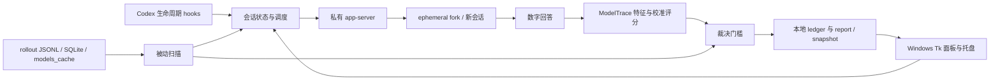

# 源码分析与 Windows 移植

分析基线：上游 [kiyoakii/is-gpt-nerfed](https://github.com/kiyoakii/is-gpt-nerfed)
0.5.3，提交 `ff0d7c0c8fdc8713273b6570b1ada1838eaad84c`。
用户提供目录中的 67 个文件与该提交一致（忽略 Git 的 LF/CRLF 转换）。
Windows 版本保留原作者、MIT 许可证与上游提交历史，具体来源见 [NOTICE](../NOTICE.md)。

## 结论与检测边界

这是一个 Codex 会话完整性监测器。它比较“客户端请求了什么”与“日志变化／模型输出指纹”。
它没有访问服务端权重，也没有测量通用能力、价格或实际计费。因此能报告可疑路由和请求参数变化，
不能仅凭一张指纹卡证明服务端换了权重、能力下降或存在商业欺诈。

它的两条检测路径相互补充：被动扫描发现客户端记录中的模型、推理力度、上下文窗口变化；
主动探测通过模型选择数字的偏好判断输出更接近哪个已登记模型。被动扫描不消耗推理额度，
主动探测通常需要三次推理，超时和传输故障可能增加次数。

## 源码结构

| 文件或目录 | 职责 | Windows 处理 |
| --- | --- | --- |
| `plugin/skills/is-gpt-nerfed/scripts/nerfed` | CLI、日志扫描、会话关联、调度、裁决、安装、JSON 快照 | 保留业务逻辑，抽离平台操作 |
| `codex_appserver.py` | stdio JSON-RPC、握手、读取和临时 fork、收集回答、拒绝工具／审批 | UTF-8、Windows 子进程和启动器适配 |
| `modeltrace_core.py` | 数字解析、特征提取、余弦分数、融合与 softmax | 保持数值算法不变 |
| `plugin/assets/modeltrace/` | 模型库、校准系数、来源与许可证 | 原样保留 |
| `plugin/.codex-plugin/plugin.json` | 插件定义和五类 hook | 源文件保持 Unix 命令；安装时生成 Windows 定义 |
| `.agents/plugins/marketplace.json` | 本地 marketplace 入口 | 生成 Windows 本地 marketplace |
| `macos/` | SwiftUI 菜单栏应用、构建、通知、更新 | 保留上游源码；新增 `windows/` 面板 |
| `tests/` | 扫描、裁决、fake app-server、JS/Python 数值对照 | 修复跨平台启动及 URI，增加 Windows 集成测试 |
| `bin/`、根安装器 | 启动与注册 | 新增 `.cmd`、`.ps1` 入口 |

共享后端仍以原有 CLI 为公共接口。没有把整个 3300 多行主脚本重新拆成第二套实现，
避免 Windows 移植同时改变统计语义和大量业务边界。`platform_support.py` 集中处理操作系统差异，
GUI 通过现有 `snapshot`、`worker`、`tick`、`config` 等命令复用后端。

## 被动扫描：请求元数据的一致性

`scan_rollout()` 按文件游标增量读取 JSONL。主要信号如下：

| 信号 | 来源 | 解释 |
| --- | --- | --- |
| 模型变化 | `turn_context.model` | 与上一轮比较；是否存在 `thread_settings_applied` 决定是否疑似静默变化 |
| 推理力度降低 | collaboration/settings 的 effort | 按 `none → … → ultra` 的顺序比较 |
| 隐藏模型 | `models_cache.json` 的 `visibility=hide` | 请求了未向用户显示的内部模型 |
| 上下文窗口缩小 | `token_count.info.model_context_window` | 请求记录的容量变小 |
| 服务级别变化 | service tier | 仅作信息，不等同于模型身份变化 |

`active_evidence()` 让每个维度只有最新变化生效，撤销的变化仍保留在日志中。
`compare_models()` 先看目录中的 successor/upgrade 指针，再看隐藏属性、型号代际、尺寸词、
目录排名、最高 reasoning effort 和上下文容量。这里的“升／降级”是有置信等级的启发式比较，
并非所有跨模型任务能力都能如此排序。

通过 Codex 设置发生的变化通常只作待确认提示：记录无法区分用户点击与软件替用户应用设置。
rate-limit 桶也不是回答模型的证明；源码仅用它展示额度接近限制的状态。

## 主动探测：保持被测会话的模型和力度

`AppServer` 启动独立的 `codex app-server --stdio`，关闭探测进程的 hooks 和通知，
以免递归触发监测。先发送 `initialize`（启用 experimental API），再发送 `initialized`。
协议以每行一个 JSON 消息运行；读取线程把响应分配给请求 ID，并保存异步通知。

会话探测依次调用：

1. `thread/read`：读取持久会话的模型、provider、cwd 等；缺失字段由本地会话记录补齐并标注来源。
2. `thread/turns/list`：找最新已完成轮次。仍在进行的轮次不能作为 `lastTurnId`。
3. `thread/fork`：指定原模型、原 reasoning effort、`ephemeral=true`、`excludeTurns=true`。
4. `turn/start`：在 fork 中要求直接选择 292–332 个 1–355 的整数，不使用工具或代码。
5. 等待最终 agent message；工具调用、审批请求、失败和严重截断都不能当成有效样本。

三份回答可并行收集。fork 忙时尝试更早的已完成轮次，否则有限等待；传输失败有限重试；
单个回答默认五分钟超时，只补一次样本。新会话探测用 `thread/start` 创建临时会话，
适合比较“旧会话”与“此刻新会话”的情况。

源码尝试使用与被测客户端一致的 originator，以减小按客户端路由产生的差异。
这仍是单独的 app-server 连接，不能证明其服务端路径与桌面连接逐字节一致。
[`thread/fork` 官方协议](https://learn.chatgpt.com/docs/app-server)确认了临时 fork、
`lastTurnId` 和分页会话 `excludeTurns` 的约束；这些实验性接口可能随 Codex 版本变化。

## 数字指纹的统计实现

数字不是用随机数生成器生成：生成器会抹去被测模型偏好。模型自己选择数字，
其数字频率、位置分布和尾数偏好成为特征。提示词和取值范围来自 ModelTrace，移植不翻译或改写。

`parse_numbers()` 取最长的有效数字串，遇到夹入文字会分段。每份回答必须有至少
`max(80, ceil(请求数量 × 0.55))` 个可用数字。它是宽容解析器，不是严格 JSON schema 验证器；
只保证与上游评分逻辑一致。

第一组特征有 355 维：统计各数字次数 `c_i`，用 0.5 平滑后取
`sqrt((c_i + 0.5) / (N + 355 × 0.5))`，即 Hellinger 特征。
按训练库的均值与 scale 标准化，投影去除 nuisance basis 中的环境方向，再归一化，
与每个模型的 centroid 作点积，最后把各模型分数转成 z-score。

第二组有 74 维：把序列分成四个位置块，每块映射到 16 个值域桶，共 64 维；
再加 10 维尾数分布。它结合不同 enrollment 环境的模板相似度与去环境方向后的相似度。
按库中权重与第一组融合（当前有序块权重 0.25），多份回答的融合分数取均值。
根据有效回答数量选择 1／2／3 份校准的 beta，输出 `softmax(beta × score)`。

保留的库文件记录了以下校准参数（只描述原训练／交叉验证实验）：

| 有效回答数 | beta | 库内 CV accuracy |
| --- | --- | --- |
| 1 | 7.27758 | 95.3125% |
| 2 | 12 | 99.6528% |
| 3 | 12 | 100% |

因此显示的百分比是在**库内候选集合**中的校准归因值。它不是“有这么大概率 OpenAI 真的换了权重”。
softmax 会放大很小的分数差，所以后端还检查原始融合分数的间隔。

`assess()` 的默认 MISMATCH 门槛是：第一候选 ≥80%，声明模型 ≤20%，
二者融合 z-score 差 ≥0.5，至少两份有效回答，并且第一候选与声明模型不同。
弱于门槛为 SUSPICIOUS；声明模型不在库内为 UNLISTED；没有有效回答为 INVALID。
第一候选就是声明模型时可报 MATCH，报告另附置信等级。活动硬证据优先，可直接报 DOWNGRADED。
网络错误和 INVALID 不覆盖历史有效裁决。

`test_parity.py` 将同一批样本送入 Python 评分器和原 JS 评分器，比较数值与排序，
验证的是移植一致性。库中的交叉验证准确率是其原 enrollment 实验指标，不能直接外推到
所有真实会话、未来模型或 Windows；本次没有重新采集样本或独立测量准确率。

## 状态、隐私与可靠性

`~/.codex/is-gpt-nerfed` 中保存配置、会话 JSON、探测完整回答、索引和结构化日志。
`probe_due()` 支持轮数差或时间间隔。时间模式比较创建／上次探测／上次提醒到当前的墙钟时间，
并非累计计算用户真正工作的分钟数；`tick` 只补查近期有 hook 活动的会话（活动窗口 15 分钟）。
新会话探测另有独立的时间调度，默认 `manual`。GUI 每 30 秒调用既有调度器。
会话更新采用跨进程锁及临时文件替换；Windows 不能直接使用 `fcntl.flock`，
也不能用 `os.kill(pid, 0)` 检查进程。Windows 版通过原生锁和非破坏性句柄检查处理这些差异。
SQLite 只读连接用于会话定位，不改写 Codex 数据库；路径用标准 file URI 编码。

`auth.json` 只用于本地计算账号哈希和掩码标签。账号变化会使旧裁决显示为其他账号并重新调度。
探测结果、凭证、用户会话均不进入 Git。主动探测本身是联网 Codex 推理，fork 会继承会话历史；
“全部本地运行”仅描述监测与评分执行位置，不意味着模型回答不经过服务器。

Codex 对非 managed 插件 hooks 要求信任当前定义，安装不会自动获得信任；这与
[官方插件文档](https://developers.openai.com/plugins/build/plugins)一致。Windows 安装器先生成并
显示命令，保留人工信任入口，显式 `-TrustHooks` 才走无人值守信任。

## Windows 实现与验收

选择 Python/Tkinter + Win32 托盘是因为核心已是无第三方依赖的 Python，
可复用现有快照协议，避免第二套评分器。PowerShell 负责安装及入口，Windows hook manifest
在本地生成，稳定副本代替需要管理员或 Developer Mode 的目录符号链接。
UTF-8 子进程和正确参数传递用于处理中文／空格路径；桌面 Codex 与 PATH CLI 取较新版本，
也支持显式指定。macOS 更新功能在 Windows 上禁用，防止取回错误平台的安装包。

GUI 的文件和进程 I/O 放在线程中，Tk 更新统一通过队列回主线程；列表、证据和裁决
直接消费后端输出。关闭窗口可留在托盘，退出后停止 GUI 定时器；已启动的探测遵循后端超时策略。

具体安装、配置与卸载见 [WINDOWS.md](WINDOWS.md)。设计取舍见
[ADR 0001](adr/0001-windows-port.md)，实际命令、测试结果和未覆盖项见
[VALIDATION.md](VALIDATION.md)。后续如果要做签名 EXE、通知中心 toast 或新模型校准，
应分别补充平台打包验收和统计验证，不能把本次兼容性测试当成相应证据。
